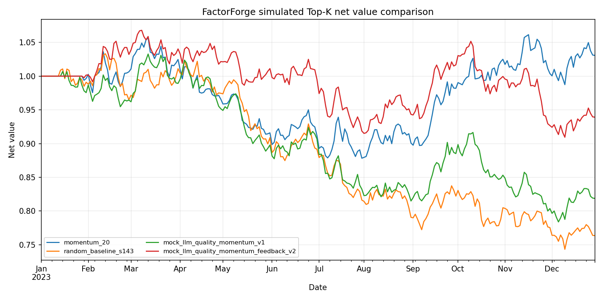
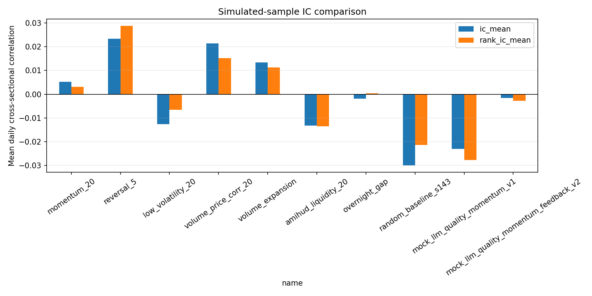

# FactorForge

> 面向“AI 算法量化研究员”岗位的可运行 MVP：让 LLM 生成结构化金融假设和受限因子表达式，自动完成安全检查、因子计算、IC/分层研究、含成本回测和一轮反馈迭代。


## 重要声明

默认 Demo 使用**确定性模拟 A 股风格日频数据**，股票代码以 `.SIM` 结尾。示例图表、IC、收益、净值和回撤全部由这份模拟数据实时计算，只用于验证工程流程，不代表真实历史业绩、投资建议或可交易结论。项目不会伪造或硬编码实验指标。

## 一分钟运行

要求 Python 3.10+。

```powershell
python -m pip install -e ".[ui,dev]"
python -m factorforge demo --config config/default.yaml --output-dir artifacts/demo
```

一条命令运行测试：

```powershell
python -m pytest
```

启动交互页面：

```powershell
streamlit run streamlit_app.py
```

页面地址通常为 `http://localhost:8501`。

## Demo 实际比较什么

默认一次执行 10 个实验，覆盖四个必须的对照组：

| 类别 | 内容 | 目的 |
|---|---|---|
| 经典人工因子 | 7 个固定价量表达式 | 可解释基线 |
| 随机因子 | 固定随机种子生成的合法表达式 | 衡量偶然发现风险 |
| 单轮 LLM 因子 | Mock 或 DeepSeek 结构化提案 | 验证“假设→表达式→研究” |
| 反馈 LLM 因子 | 读取实测指标与规则诊断后修订一次 | 验证闭环；不自动宣称改进 |

内置 7 个经典因子：20 日动量、5 日反转、20 日低波、量价相关、成交量扩张、Amihud 风格流动性、隔夜跳空。

## 安全因子 DSL

示例：

```text
Rank(Mean(close / Delay(close, 1) - 1, 20))
- 0.5 * Rank(Std(close / Delay(close, 1) - 1, 20))
```

- 字段白名单：`open`、`high`、`low`、`close`、`volume`、`amount`、`vwap`
- 算子白名单：`Rank`、`Delay`、`Delta`、`Mean`、`Std`、`Corr`、`Sum`、`Min`、`Max`、`Abs`、`Sign`
- 只允许 `+ - * /` 和数值常量
- 窗口/滞后必须为 1–252 的正整数；负滞后会被拒绝
- 不允许属性访问、下标、导入、任意函数调用或未来收益字段
- 分母绝对值过小时转为 `NaN`，禁止产生无穷值
- 不使用 Python `eval`

因子在 `t` 日收盘后计算，IC 和回测都使用 `t→t+1` 的下一期收益。

## 指标与回测

- 日度截面 Pearson IC、Spearman Rank IC
- ICIR、Rank ICIR、IC 为正比例、覆盖率
- 五分位收益与 Q5−Q1 多空差
- Top-K 等权组合
- 按换手率扣除单边手续费
- 毛/净收益、净值、年化收益/波动率、Sharpe、最大回撤
- 反馈诊断：弱 Rank IC、高换手、低覆盖、较大回撤和同样本过拟合提醒

年化指标仅是对输入样本的机械换算，默认样本又是模拟数据，不能视为业绩陈述。

## DeepSeek V4

项目使用 OpenAI Python SDK 的兼容接口，密钥只从环境变量读取。DeepSeek 官方当前模型名为 `deepseek-flash`（V4.1 Flash）和 `deepseek-v4-pro`，OpenAI 兼容基础地址为 `https://api.deepseek.com`。

PowerShell：

```powershell
$env:DEEPSEEK_API_KEY="你的密钥"
$env:DEEPSEEK_MODEL="deepseek-flash"  # 或 deepseek-v4-pro
$env:DEEPSEEK_BASE_URL="https://api.deepseek.com"
python -m factorforge demo --llm-mode deepseek --output-dir artifacts/deepseek
```

没有密钥时使用默认 `mock` 模式，完整流程仍可离线运行：

```powershell
python -m factorforge demo --llm-mode mock
```

配置参考 `.env.example`。项目不会自动读取或保存 `.env`；是否通过系统、IDE 或密钥管理器注入环境变量由使用者决定。

官方参考：[DeepSeek API 首次调用](https://api-docs.deepseek.com/guides/function_calling/) · [模型与价格](https://api-docs.deepseek.com/quick_start/pricing)

### 通过阿里云百炼 / DashScope 调用

如果你拿到的是阿里云百炼 API Key，只需在 PowerShell 中设置一个环境变量，然后运行 `dashscope` 模式：

```powershell
$env:DASHSCOPE_API_KEY = "你的百炼密钥"
python -m factorforge demo --llm-mode dashscope --output-dir artifacts/dashscope
```

默认模型为 `deepseek-v4-flash`，默认使用百炼北京地域通用 OpenAI 兼容地址。可选覆盖：

```powershell
$env:DASHSCOPE_MODEL = "deepseek-v4-pro"
$env:DASHSCOPE_BASE_URL = "https://dashscope.aliyuncs.com/compatible-mode/v1"
```

若百炼控制台为你提供了带业务空间 ID 的专属 Base URL，应将 `DASHSCOPE_BASE_URL` 改为控制台给出的完整地址。[阿里云百炼 DeepSeek 官方文档](https://help.aliyun.com/zh/model-studio/deepseek-api)

## 接入真实 A 股数据

AkShare 是可选网络依赖：

```powershell
python -m pip install -e ".[realdata]"
python -m factorforge fetch `
  --symbols 000001.SZ,600000.SH `
  --start 2023-01-01 `
  --end 2025-12-31 `
  --adjust qfq `
  --output data/a_share_sample.csv
```

随后对任意符合格式的 CSV 运行同一套研究：

```powershell
python -m factorforge research-csv `
  --input data/a_share_sample.csv `
  --output-dir artifacts/real_csv `
  --llm-mode mock
```

CSV 必须包含：`date,symbol,open,high,low,close,volume,amount`，每个 `date/symbol` 只能出现一次。真实数据的授权、质量、复权、停牌和退市处理由数据使用者负责。

## 自动生成的产物

`artifacts/demo/` 包含：

- `comparison.csv`：全部因子及指标
- `summary.json`：数据标签、参数、免责声明和结果
- `factor_proposals.json`：随机/LLM 的结构化假设
- `feedback_advice.json`：规则诊断和反馈前后同样本指标差
- `equity_curves.csv`
- `equity_curves.png`
- `ic_comparison.png`
- `quantile_returns.png`





## 项目结构

```text
FactorForge/
├── config/default.yaml
├── docs/architecture.svg
├── src/factorforge/
│   ├── data.py          # 模拟、CSV、AkShare 数据适配
│   ├── dsl.py           # AST 校验与安全表达式引擎
│   ├── factors.py       # 经典因子与随机基线
│   ├── llm.py           # Mock / DeepSeek 结构化生成
│   ├── research.py      # IC、分层和 Top-K 回测
│   ├── pipeline.py      # 四类实验与反馈闭环
│   ├── reporting.py     # CSV/JSON/PNG 报告
│   ├── app.py           # Streamlit 页面
│   └── cli.py
├── tests/
├── streamlit_app.py
├── pyproject.toml
├── Dockerfile
└── .env.example
```

## Docker

```powershell
docker build -t factorforge .
docker run --rm -p 8501:8501 factorforge
```

若使用 DeepSeek：

```powershell
docker run --rm -p 8501:8501 `
  -e DEEPSEEK_API_KEY=$env:DEEPSEEK_API_KEY `
  -e DEEPSEEK_MODEL=deepseek-flash `
  factorforge
```

## 研究边界与下一步

当前 MVP 没有替代严谨实盘研究。真实 A 股研究还应补充：

1. 可交易股票池、上市天数、ST/退市、停牌、涨跌停和成交容量约束；
2. 无未来信息的指数成分股历史、行业/市值中性化和风险模型；
3. 可靠复权、公司行动和点时数据库；
4. walk-forward、滚动训练、样本外与多重检验校正；
5. 更真实的冲击成本、滑点、排队成交和调仓时点；
6. 因子正交化、组合优化、实验追踪及数据版本管理。

因此，`research-csv` 的结果也只是研究输出，不应直接用于交易。
